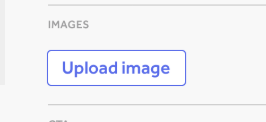

# Hidden Benefits 
# of Unit Tests 

#### @rachelcdavies @tes_engineering


Notes:  
Unit tests provide a quick way for us to confirm our code is working as we expect,
many developers remain unconvinced whether it's worth investing time writing unit tests, 
especially in front-end projects. 
Once we have implemented a working solution, there's often pressure to move on to adding more crowd-pleasing features rather than trying to wrap our code 
with tests. 
The benefit of writing unit tests is not limited to automated checking our code still works. 
I'll share some less obvious benefits for investing time writing unit tests with some 
examples drawn from a recent project using GraphQL.

---

## A bit about me

* Full-stack software engineer
* Work remotely from home in Bath
* XP/TDD fan since 2000

Notes: 
I started coding 30 years ago before the web and Javascript existed.
I spent time coding in Ada, C, C++, Java and Ruby. 
Relatively new to JavaScript.
20 years ago I was an early adopter of eXtreme Programming an Agile software development approach.
After some years consulting, I made a shift back to coding.
so I could stop commuting to London.
Moved to Bath before Xmas and work from home for Tes.

---

## A bit about Tes

* Digital education company
* 200+ Javascript micro-services Node/React 
* 50+ full-stack engineers in 12 product squads
* Remote-first culture

Notes: We support and connect teachers and schools worldwide, 
helping them to improve children's lives through education
       
---

## Your Background?


Notes: 
Who is new to unit-testing?
Who regularly writes unit-tests?
Who prefers not to write unit-tests?

---

# Introduction to Tests

----

## What is a Test?

> _"A test is some code that checks some other code works as expected."_

Notes: 
We often check code works by running the application and clicking through as a user would.
The subject of the test is the code being tested.
There are lots of frameworks to help you write tests.

----

## What is a Unit Test?


https://www.martinfowler.com/bliki/UnitTest.html

Notes: 
Unit tests call some small chunk of code that is part of a larger application. 
Typically in JS this would be a component or a function.
Unit tests are organised into suites and can be run for a whole application.

----

## Test Frameworks


Notes: 
There are lots of frameworks to help you write tests, such as Tape, Mocha, Ava, etc
Some test frameworks test the whole application from the outside.
Others help us write tests for smaller parts of an application

----

##### Simple Example using Mocha

``` javascript

describe('Array object', () =>{
  // add a describe block for function under test

  describe('indexOf', () => {

    // a test case
    it('should return negative index when not present', () =>  {

      const arrayUnderTest = ['banana, apricot'];

      const result = arrayUnderTest.indexOf('apple');

      assert.equal(result, -1);
    });

    // another test case
    it(' should return index when present', () =>  {
    
      const arrayUnderTest = [1,2,3];
  
      const result = arrayUnderTest.indexOf(3);

      assert.equal(result, 2);
    });
    
  });
});
```

Notes: 
There are lots of frameworks to help you write tests, such as Tape, Mocha, Ava, etc
Some test frameworks test the whole application from the outside.
Others help us write tests for smaller parts of an application

----
## Anatomy of a Test

* Arrange: 
    * setup preconditions and inputs
* Act: 
    * on component or function under test
* Assert: 
    * expected results have occurred

----

##### Example of 3As

``` javascript

describe('indexOf', () => {
    // a test case
    it('should return negative index when not present', () =>  {
      // Arrange
      const arrayUnderTest = ['banana, apricot'];
      const expectedResult = -1;
      // Act
      const result = arrayUnderTest.indexOf('apple');
      // Assert
      assert.equal(result, expectedResult);
    });
});
```

Notes: 
There are lots of frameworks to help you write tests, such as Tape, Mocha, Ava, etc
Some test frameworks test the whole application from the outside.
Others help us write tests for smaller parts of an application

----

## Tests as Documentation

* Tests illustrate what your code does
* Examples show what data it handles
* Test cases show how it handles error cases

Notes: 

----

##### Another Example

``` javascript
describe('email', () => {
    const validEmail = 'a@b.com';
    const invalidEmailEmail = 'a@b.';

    it('returns a validation error message when the value is not a string', () =>
      [0, false, [], {}, true].forEach(notStringVal =>
        expect(email()(notStringVal)).to.be.a('string')));

    it('returns a validation error message when the string value is NOT a valid email address', () =>
      expect(email()(invalidEmailEmail)).to.be.a('string'));

    it('returns undefined when the string value is a valid email address', () =>
      expect(email()(validEmail)).to.equal(undefined));

    it('returns undefined when the value is empty', () =>
      [undefined, null, ''].forEach(emptyVal => expect(email()(emptyVal)).to.equal(undefined)));

  });
  
  ```
  
  Notes: 

----

## Test Doubles

* Stubs
* Mocks
* Spies

Notes: 
Test-doubles stand in for code that the subject of the test relies on.

----

## Solitary or Sociable?


https://www.martinfowler.com/bliki/UnitTest.html

Notes: 


----

## React Component

###  with 2 render states




----

## React Component with 2 states


``` javascript
describe('image input', () => {
  it('renders with upload button when no image url', () => {
    const wrapper = mount(<ImageInput />);
    assert.include(wrapper.html(), 'Upload image');
  });
  it('renders with trash button when image url is present', () => {
    const imageUrl = 'https://www.tes.com/cdn/marketing/1554893062093-kitten-200x100.jpg';
    const wrapper = mount(<ImageInput value={imageUrl} />);
    assert.include(wrapper.html(), 'kitten-200x100.jpg');
    assert.include(wrapper.html(), 'name="deleteImage"');
  });
  it('renders upload button when image url is deleted', () => {
    const imageUrl = 'https://www.tes.com/cdn/marketing/1554893062093-kitten-200x100.jpg';
    const wrapper = mount(<ImageInput value={imageUrl} />);
    wrapper.find('button').simulate('click');
    assert.include(wrapper.html(), 'Upload image');
  });
```

Notes:

----

## Further Reading

#### Tutorial on React Component Tests

https://www.robinwieruch.de/react-testing-tutorial

----

## GraphQL Component

``` javascript
import React from 'react';
import { describe } from 'mocha';
import { assert } from 'chai';
import Adapter from 'enzyme-adapter-react-16';
import { MockedProvider } from 'react-apollo/test-utils';
import { configure, mount } from 'enzyme';
import wait from 'waait';

import { LIST_COMPONENTS_FOR_SLOT } from '../../src/common/queries/ListComponents';
import { ComponentSelectorContainer } from '../../src/common/components/ComponentSelectorContainer';

const slotId = 123;

const component1 = {
  id: 1,
  name: 'Super cool component',
  props: {
    contextSchema: {
      properties: {
        name: {
          type: 'string',
          group: 'content',
        },
      },
    },
  },
  __typename: 'Component',
};


const component2 = {
  id: 2,
  name: 'Yet another cool component',
  props: {
    contextSchema: {
      properties: {
        name: {
          type: 'string',
          group: 'content',
        },
      },
    },
  },
  __typename: 'Component',
};

const mockEmptyQuery = {
  request: {
    query: LIST_COMPONENTS_FOR_SLOT,
    variables: {
      slotId,
    },
  },
  result: {
    data: {
      listComponentsForSlot: [],
    },
  },
};

const mockEmptyQueryWithoutSlotId = {
  request: {
    query: LIST_COMPONENTS_FOR_SLOT,
    variables: {
      slotId: null,
    },
  },
  result: {
    data: {
      listComponentsForSlot: [],
    },
  },
};


const mockQuery = {
  request: {
    query: LIST_COMPONENTS_FOR_SLOT,
    variables: {
      slotId,
    },
  },
  result: {
    data: {
      listComponentsForSlot: [
        component1,
        component2,
      ],
    },
  },
};

configure({ adapter: new Adapter() });

describe('component selector', () => {
  it('renders when no components available for a given slot', async () => {
    const wrapper = mount(
      <MockedProvider mocks={[mockEmptyQuery]}>
        <ComponentSelectorContainer slotId={slotId} setSelectedComponent={() => {}} />
      </MockedProvider>,
    );
    await wait(0);
    wrapper.update();

    assert.equal(wrapper.find('select').length, 1);
    assert.equal(wrapper.find('option').length, 0);
  });

  it('renders a message when no slot is selected', async () => {
    const wrapper = mount(
      <MockedProvider mocks={[mockEmptyQueryWithoutSlotId]}>
        <ComponentSelectorContainer slotId={null} setSelectedComponent={() => {}} />
      </MockedProvider>,
    );
    await wait(0);
    wrapper.update();

    assert.equal(wrapper.find('select').length, 0);
    assert.equal(wrapper.find('option').length, 0);
    assert.include(wrapper.html(), 'Please select a slot');
  });

  it('renders when two components available for a given slot', async () => {
    const wrapper = mount(
      <MockedProvider mocks={[mockQuery]}>
        <ComponentSelectorContainer slotId={slotId} setSelectedComponent={() => {}} />
      </MockedProvider>,
    );
    await wait(0);
    wrapper.update();

    assert.equal(wrapper.find('select').length, 1);
    assert.equal(wrapper.find('option').length, 2);
    assert.include(wrapper.html(), component1.name);
    assert.include(wrapper.html(), component2.name);
  });
});

```

----

## Read more

https://www.apollographql.com/docs/react/recipes/testing

---

# The Trade-Offs?

Notes: 

----

## Obvious Benefits :-)

* Quick automatic checking that the code works
* Write once, run many times
* Documentation for future developers

----

## Obvious Cost :-(

* Takes time to write tests
* Takes time to maintain tests as code changes
* May be a barrier to refactoring code

----

## When to write unit tests?

* Concurrent with developing code
    * helps you shape your code
    * make progress when end-to-end is not ready
* When you have non-trivial logic
    * helps you document your code
    * helps you uncover edge cases

Notes: 
Test first?

----

## When not to write unit tests?

* Time consuming and fiddly to setup
* Area of code that is likely to change
* When what code does is obvious and trivial

Notes: 

---

## Unit tests help you to ..

* Shape the design of your code
* Work on components independently
* Figure out API to backend services
* Save time checking you didn't break functionality!

Notes: Summing up ^^

---

## Thank You
#### @rachelcdavies @tes_engineering


Notes: We're hiring :-)
