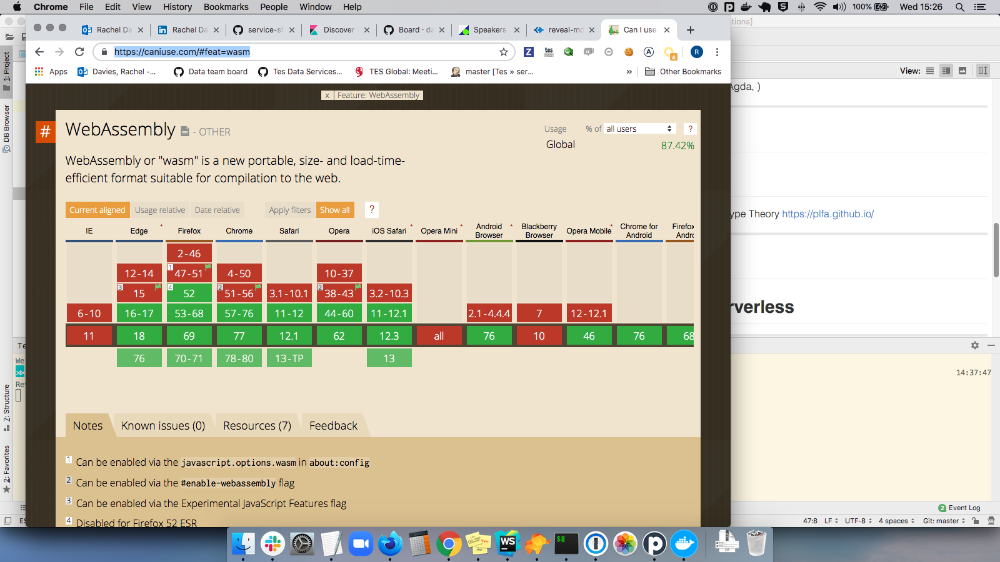

# Conference Report
# Full Stack Fest
### https://2019.fullstackfest.com/
Sitges, Barcelona
September 4—6, 2019

Notes:
I flew out on the day before and flew back on day 3. 
I attended single-track talks.
I did not sign-up for workshops as those cost extra.
 
---

## The Blurb

> A 3-day, single track conference with a workshops day about topics ranging from GraphQL, WebAssembly, the JAMStack & Progressive User Interfaces to HTTP/3, Automation Testing, Serverless and the P2P web."

> No matter if you consider yourself a backend, frontend developer, or anywhere in-between, Full Stack Fest is for you."

https://2019.fullstackfest.com/

---

## Highlights Video

https://www.youtube.com/watch?v=Wf4cmblHVoE

---

## Videos of Talks

https://conferences.codegram.com/conferences/fsf2019

---

## TL;DR

* interesting talks ( accessibility )
* irrelevant talks ( Agda, Applitools, BeakerBrowser )

---
## Soueidan: Applied Accessibility

> Hide Native Checkboxes __Accessibly__ !!!
* Use HTML5 landmarks, provide headings for screen readers
* Check Accessibility in Chrome dev tools
* __sr-only__ styles for users not using a screen reader
* aria-labelledby
* https://scottaohara.github.io/a11y_styled_form_controls/src/checkbox/

Notes: Position native checkbox ON TOP of the replacing element

---
## Byron: React Suspense

* https://itnext.io/what-the-heck-is-this-in-react-suspense-c5e641e487a
* https://reactjs.org/docs/react-api.html#reactsuspense

---

## Douglas: JAM stack

* JS, APIs, Markdown
* The thing that they all have in common is that they don’t depend on a web server.

---

## Williams: WASM / Wrangler

* Building tools for developers, Stroustup rule
> New features - Loud syntax
> Established features - terse
* To improve the development of tools surround yourself by junior developers

---

## CSS Houdini

> Houdini is a new W3C task force introducing a new set of APIs that will give developers the power to extend CSS itself, and the tools to hook into the styling and layout process of a browser’s rendering engine.
* http://houdini.glitch.me/
* https://ishoudinireadyyet.com/
* https://drafts.css-houdini.org/css-paint-api/

Notes: only available for paint at the moment

---

## Cua: Serverless AWS Lambda

---

## Drasner: Future of Web Animation

* A-Frame
* AR in the browser

---

## Chisa: Dark Lang

* https://darklang.com/
> Generate and run scalable infrastructure.
  Use APIs as easily as if they were functions.
  Remove the deployment step entirely.
* currently in _"private beta"_

---

## Jones: Visual Testing with Applitools

* Applitools is a thin layer on top of Selenium that provides AI capabilities to simplify your tests.
* _"Pricing plans available to suit your needs..."_

---

## Klabnik: Rust / WASM / Serverless

---

## Stenberg: HTTP/3 

* HTTP over QUIC

Notes: the guy who wrote cURL

---

## Wadler: Proofs with Agda

Academic Proofs Language based on Type Theory
https://plfa.github.io/

---

## Frazee: P2P Beaker Browser

Beaker is an experimental browser for exploring and building the peer-to-peer Web.
https://beakerbrowser.com/

---

## Freebies

* socks
* metal water bottle
* stickers

---

## Food

* delicious veggie buffet lunches
* no veggie option at party

---

## Questions?

