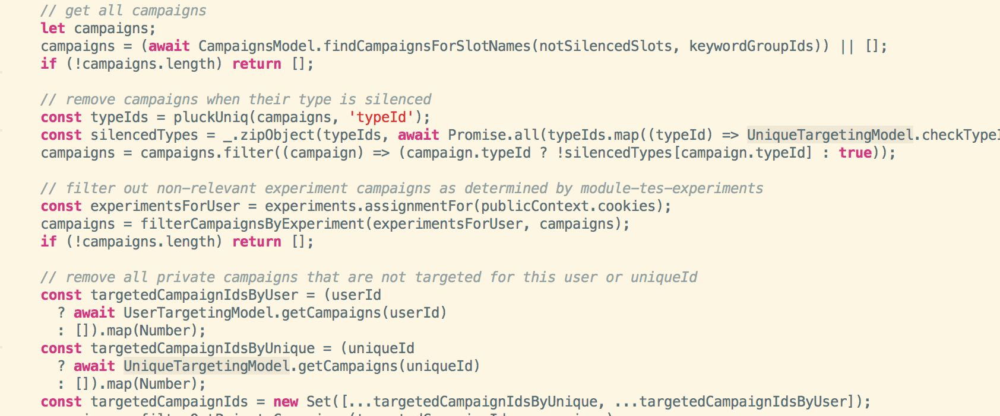

# A Refactoring Episode
## in service-marketing 

Notes:  This is a short talk about a recent refactoring by MarTech team.

---

## Refactoring

Change made to restructure code making it easier to understand and cheaper to modify without changing its behaviour.

Notes: Martin Fowler wrote the original book on Refactoring back in 2000. 
The 2nd edition was published in 2018 with JavaScript examples.

---

## Before We Refactored

Notes: I was trying to investigate why an experiment wasn't working. 

---

## Code Smells

* Mysterious Name
* Long Function
* Comments

Notes: these are just a few from the Refactoring book

---

## After Refactoring

Notes: we were aiming for this

---
## Baby Steps

Notes: make small changes and check tests still pass.

---

## Performance Improvements

Notes:  Cleaner code helped us to see some performance improvements.

---

## Check no errors

Notes:  We only had acceptance tests for main scenarios. 
Unit tests help pick up

---

## Summary

* Take baby steps
* Keep running the tests
* Cleaner code reveals performance opportunities
* Check performance not impacted negatively

---

### Questions?
