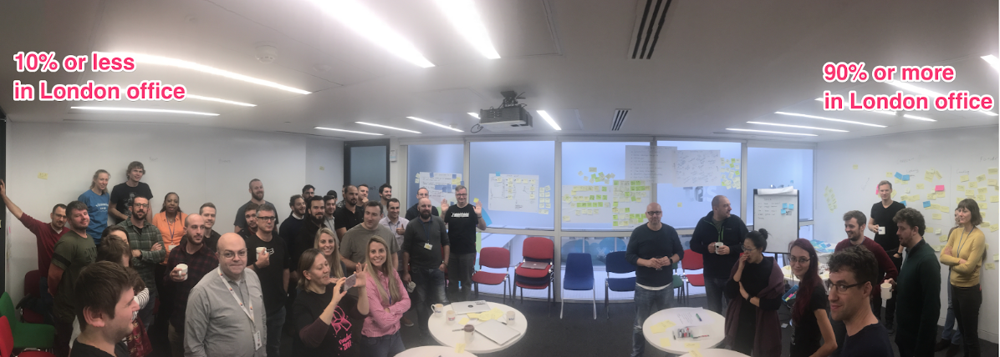
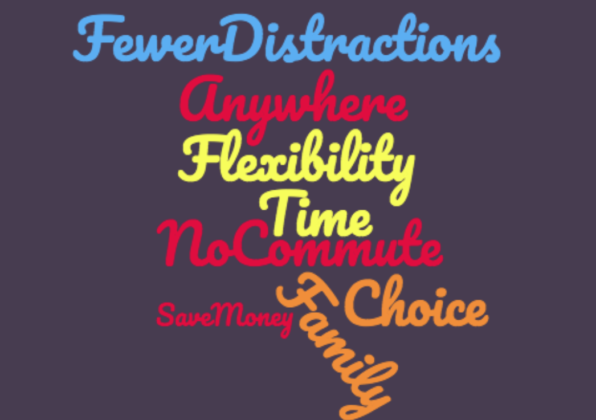
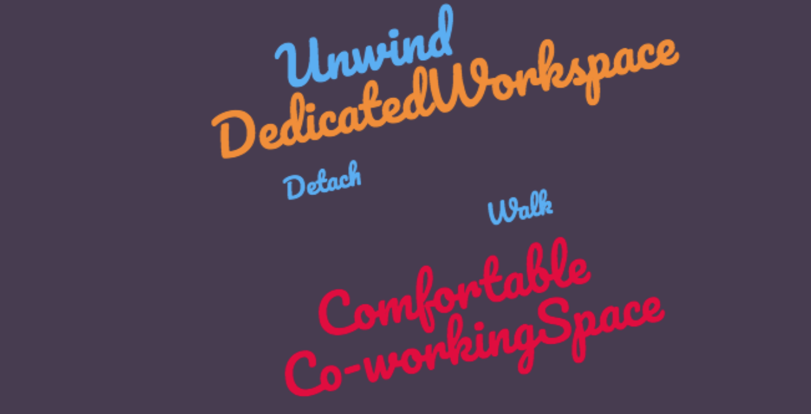

## "remote-first" @tes_engineering ?

---
## Remote vs Office 2018

Notes: 

---

Notes: 
Survey question: What are the benefits for you when working remotely?
* Flexibility: time / place / family
* Saves time & money spent on commuting
* Removes travel stress
* Control over work environment
* Focus time

---

## Drawbacks?

Notes: 
Survey question: What are the drawbacks for you when working remotely?
* Loneliness & isolation
* Lack of spontaneous chat
* Asking for help
* Switching off in the evening
* Team communication across timezones

---

## What do you miss?

Notes: 
Survey question: Is there anything you miss about working in the office environment?
* Spontaneous conversations
* Seeing friends not in my team
* Team lunches & coffees
* Range of shops

---

## Tips from Engineers

Notes: 
Survey question: What tips do you have for a good remote work environment?
* Dedicated comfortable workspace
* Get dressed for work
* Try co-working space
* End of day: detach & unwind
* Go out for a daily walk

---

## Contact Habits

* Mark availability in Slack
* Chat about personal stuff before stand-up/pairing
* Remote pairing with video on

Notes: 
Survey question: What habits do you have to stay in good contact with your team mates?

---

## Anything Else?

* Worry that in office workers get more promotion
* Demonstrating you're doing your job and not slacking
* Option to work in office suits some people

Notes: 
Survey question: Anything else you'd like to say about working remotely?

---

## Quotes from Survey

* "It changed my life! I can't go back to the pain of commuting to Central London everyday."
* "I'm wayyy more productive working remotely."
* "I find remote pairing as good as if not better than actually pairing in person."
* "I think it takes experimentation to work out what's right for you."

