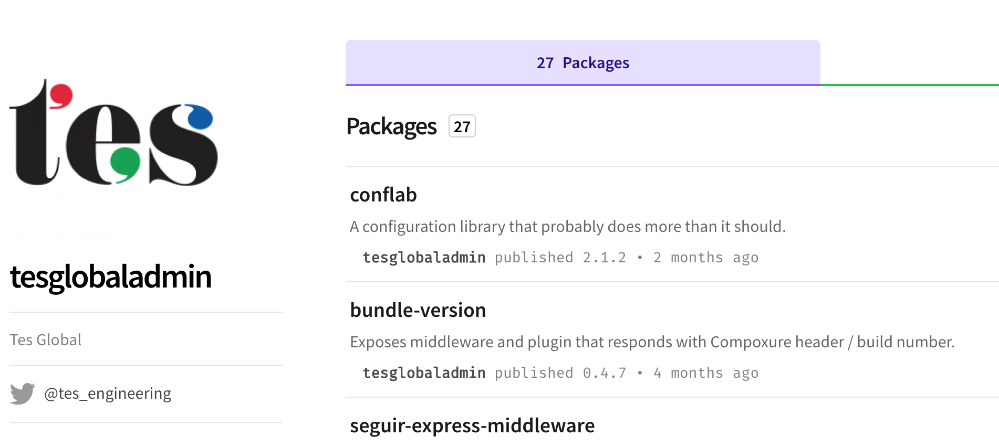

# Microservices: Sharing Is Caring

#### @rachelcdavies @tes_engineering

Notes:  
Maintaining shared micro-services is a pragmatic approach to building resilient products.
At Tes, we have a dozen teams building products that use common shared micro-services for basic services, such as sending emails and authentication/authorization. Although the idea sounds simple, in practice sharing code between teams can be challenging. Shared services risk becoming polluted with product-specific details or turning into no-go areas that engineers fear to change. Come to this talk to hear about how we overcome these challenges at Tes and hear our tips for how to maintain a healthy set of shared micro-services.

---

## A bit about me

* Software engineer
* Work remotely from home
* XP/Agile fan since 2000

Notes: 
I've been working in software development since 1987. 
I worked in one of the first teams to practice Extreme Programming in London back in 2000. 
I became fascinated with the world of Agile software development and spent a decade avidly reading Agile books and participating in Agile conferences. 
I'm now a senior software engineer developing JavaScript micro-services at Tes.

---

## A bit about Tes

* Digital education company
* 200+ Javascript micro-services Node/React 
* 50+ full-stack engineers
* Remote-first culture

Notes: 
Who's heard of the Times Educational Supplement? 
We are more than a publication, we provide services that help schools recruit teachers and for teachers to share teaching resources. We support and connect teachers and schools worldwide, helping them to improve children's lives through education. 
A few years ago, our CTO Clifton Cunningham and VP of Engineering David Morgantini led a transition to a micro-services architecture building up product teams with ThoughtWorks alumni. I wasn't working at the company at the time so can't share much detail on how our remote-first got started but Martin Fowler was writing about remote-first at the time. Over the past few years we've established some ways of working that help us sustain remote working and I'll be sharing some more practical details of how Hack Days and Knowledge Sharing sessions underpin our remote working practice.

---

---

## About you?

Notes: 
Add some questions here       

---

# Sharing?

Notes: Why do we share?
* using existing services saves time
* reduce duplication

---

# Microservices?

---

# Homogenous Services

* JS React/Node services
* REST / RabbitMQ 

Notes: 
supported by Engineering Guide
Built from ex-TWers about 5 years old
Although CTO/VP of Eng have left

---

## People Architecture 

Notes: 
Remote workers so Slack channels

---

# Organisation structure

* Cross-functional product teams responsible for vertical sliced services
* Data, Platform teams responsible for infrastructure
* Security team roving
* New DX group 

---

# Frontend 

### Tes Design System (TDS)
* Styled components (buttons, checkboxes)
* Styles (typography, colours)

Notes: 
Monthly front-end days.
Engineers who are interested.
Starts with a stand-up
https://www.tes.com/styleguide/elements/button

---

# Plumbing

Stable services 
* Page layout
* Generating PDF documents
* Sending emails
* Sending SMS messages

Notes:
See Rouan blog post
https://techbeacon.com/app-dev-testing/4-ways-stop-your-shared-microservices-falling-apart
Some are open-source.

---

# Open Source

Notes:
https://www.npmjs.com/~tesglobaladmin

---

# Dedicating Time

* Front-end days, 1 per month
* Hack days, 2 per month
* Tech debt days, coming soon 

Notes: 
Every last thursday of the month, the folks interested in the Frontend at tes topic (so, not app-specific frontend tasks) meet up and hack together on general/broad frontend related tasks. The day before (so, wed) there is a sort of quick "kick off" where we decide who is gonna work on what, and the morning after (so, fri) there is gonna be a sort of quick "retro" to see what has been done. If you want to participate just drop an email/message to the current frontend champion

---

# Challenges

* Fear of touching old code
* Preventing domain logic creeping in

---

# Tes Culture

* Post-mortems on outages
* Champions
* Helping others 
* Mentoring
* Knowledge sharing

Notes: 

https://internal.tes.com/engineering/docs/how-to/have-a-post-mortem.html

---

## Summing Up

* Hire crafts people who care
* Technical oversight (Principal/Systems Engineers)
* Open communications (Slack)

Notes: Summing up ^^

---

---

## Thank You
#### @rachelcdavies @tes_engineering

Notes: We're hiring :-)
