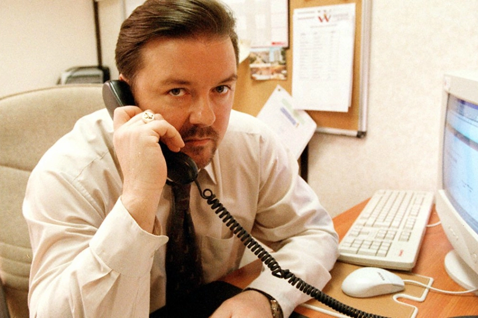

# Sustaining Remote-First Teams

#### @rachelcdavies @tes_engineering

Notes:  
Curious about how to build and sustain a ‘remote-first’ culture? At Tes we have more engineers working from home or travelling than sitting at a desk in our London office. Over the last few years we adapted our engineering practices to support small teams working in close collaboration over distance. Part of what sustains this way of working is the way we organise hack days and engineering weeks and other cross-team initiatives.
---

## A bit about me

* Full-stack software engineer
* Work remotely from home in Bath
* XP/TDD fan since 2000

Notes: 
Rachel Davies is a world-renowned expert in Agile approaches to software development, especially Extreme Programming (XP) and an author of the first book on Agile Coaching . In 30 years, she’s seen programming languages and design methodologies come and go. Her current role is as a senior software engineer developing JavaScript micro-services at Tes Global, a digital education company that aims to develop products and services that will make the greatest difference in global education.

---

## A Personal Story

Notes: 
Before I worked at Tes, I lived in Rugby - 100 miles north of London. My commute was 90mins from door-to-door, I spent a minimum of 7.5 hours travelling to work each week when there were no train delays. Most evenings I got home after 7:30pm. When my kids were younger this was just in time to read them a bedtime story but too late for family meals.

---

## A bit about Tes

* Digital education company
* 200+ Javascript micro-services Node/React 
* 50+ full-stack engineers in 12 product squads
* Remote-first culture

Notes: We support and connect teachers and schools worldwide, 
helping them to improve children's lives through education
       
---

## Your Background?

Notes: 
Who works from home ?

---

## Traditional Agile Wisdom

>_"Individuals and Interactions over Process and Tools"_

>_“The most efficient and effective method of conveying information to and within a development team is face-to-face conversation.”_ Agile Manifesto, 2001

--

## Seeded by TW 
> _"agile software development is incompatible with remote working ..."poppycock."_

https://martinfowler.com/articles/remote-or-co-located.html

Notes:

--

## Software is Special

Notes: I was trying to describe what it's like to make software to my neighbour. Software as a material is not like a physical material. If you make an egg-cup it can be used by 1 person at a time in the same location. If you make software, it can be used by many people in different locations at the same time.
C'est n'est pas une pipe

--

## The Office

Notes: Nothing we need to access the code is in the office.

---

## Remote-First

Notes:

--

## @tes_engineering Survey

Notes:

---

## Co-located Teams

Notes: 

---

## Time is precious

Notes: 

---

## Obvious Benefits :-)

Notes: 

---

## Obvious Cost :-(

Notes: 

---

## Summing Up

* Some things you can do

Notes: Summing up ^^

---

## Thank You
#### @rachelcdavies @tes_engineering

Notes: We're hiring :-)
